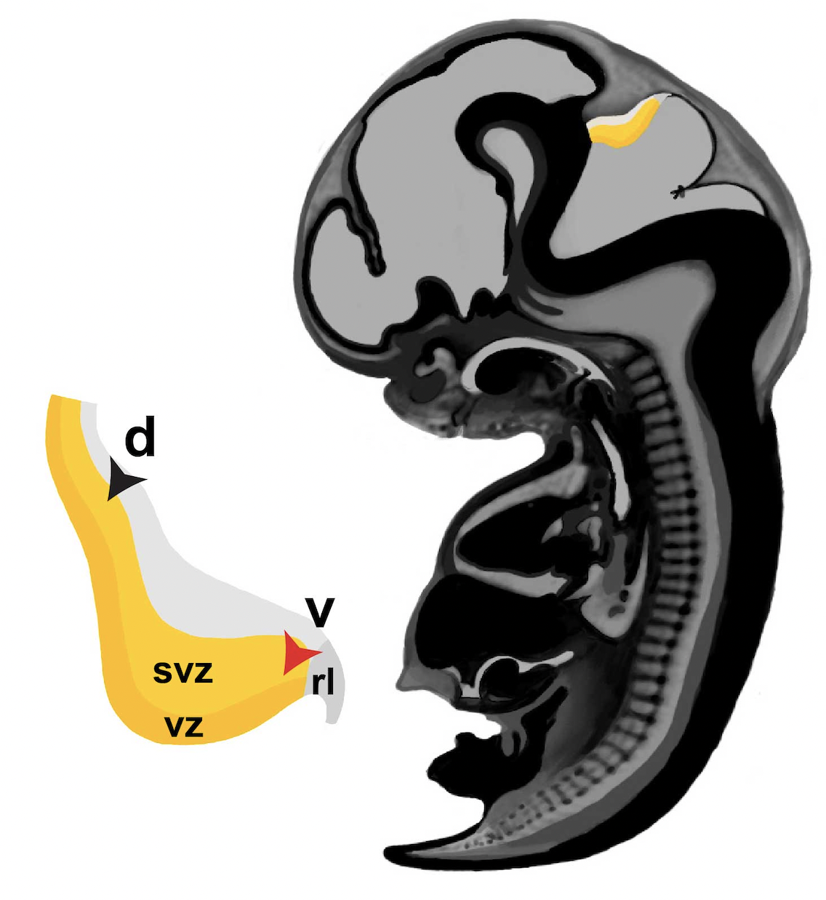

# Cerebellar VZ Derivatives

This repo is for sharing code used in preparation of the Cerebellar VZ Derivatives paper.

## Show me the code
• All code is stored in [src/scripts](./src/scripts).

## License
This project is licensed under the MIT license. Please see the LICENSE file in the repository for more information.

## Acknowledgements
Massive thanks to the donors, and to the teams at the Taylor and Millen labs.

## Contact
Questions? Comments? You can DM me here on GitHub or at: anders dot erickson at mail dot utoronto dot ca.
